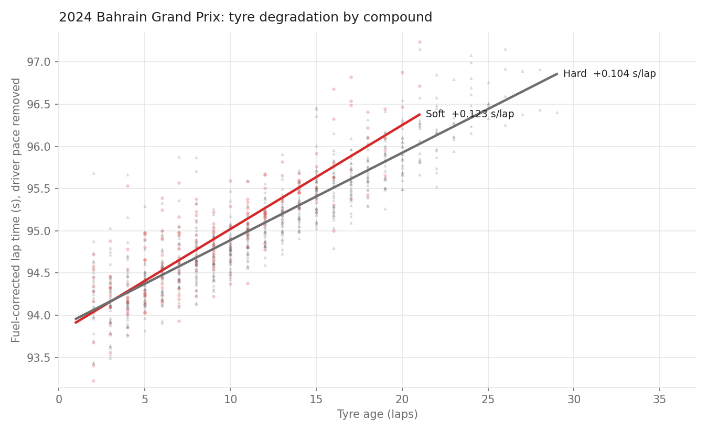
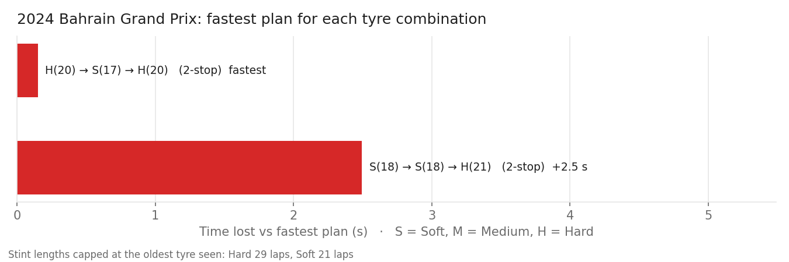
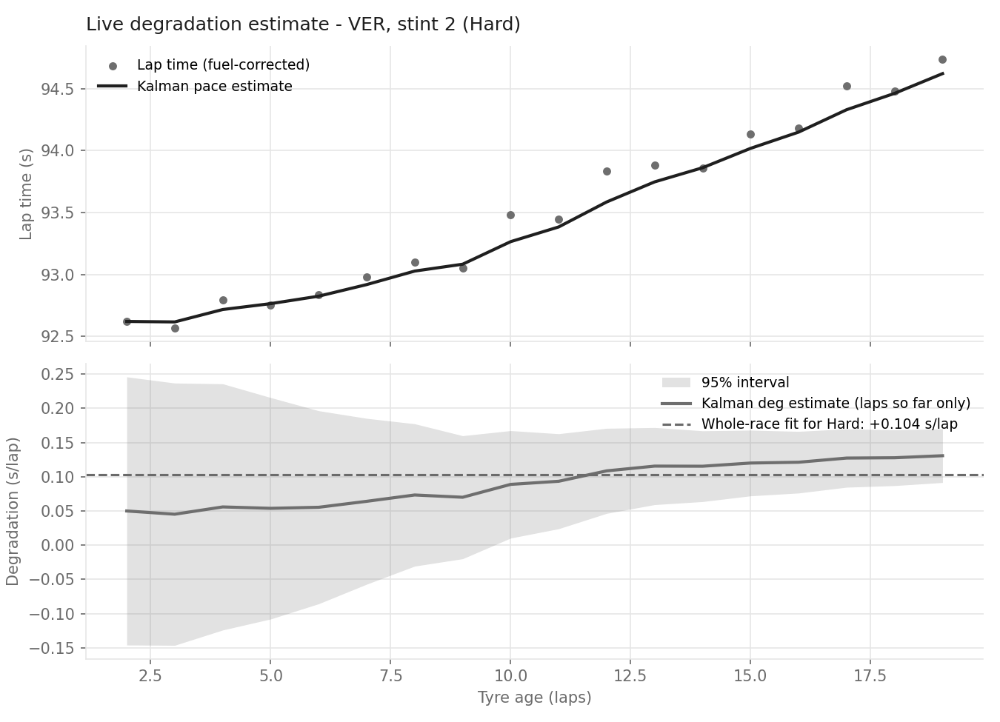
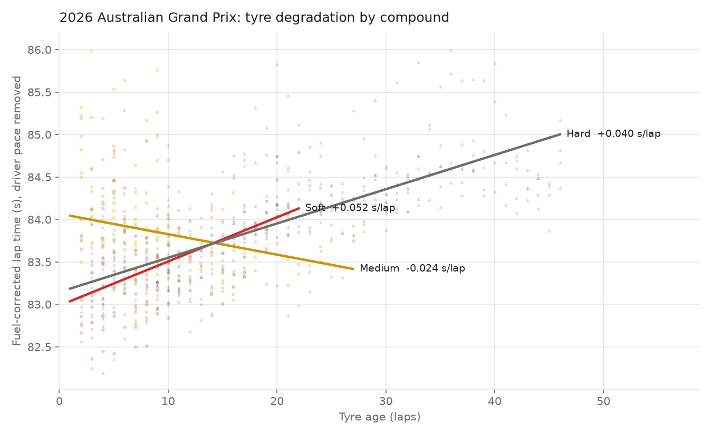
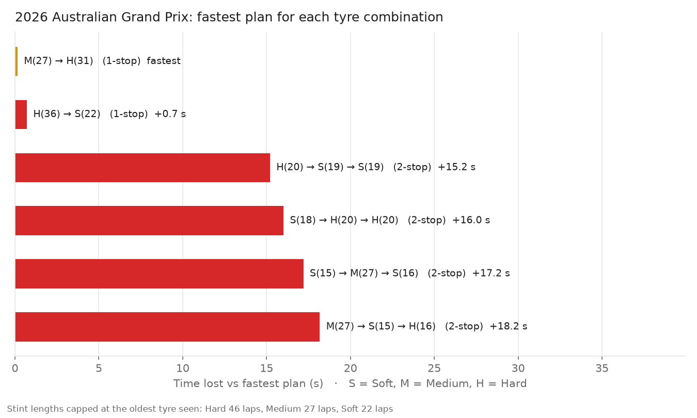

# F1 Tyre Degradation Model

A Python project that works out how quickly F1 tyres wear out during a race, and uses that to find the fastest pit stop strategy. It uses real timing data from the FastF1 library, tested on the 2024 Bahrain and 2026 Australian Grands Prix.



## Why I built this

I wanted to see if the Kalman filter I built for my pendulum project could work on actual data, and F1 timing data seemed suitable since tyre wear is hidden behind a lot of noise. 
I was also interested in how teams decide when to pit. The most interesting part was finding that my first version blamed the track getting faster on the soft tyre.

## How it works

1. **Clean the data** - remove laps that don't show standard race pace: pit stop laps, the first lap, safety car laps, and one-off slow laps (traffic, mistakes).
2. **Account for fuel and track** - cars get faster as the race goes on because fuel gets used up and the track gets grippier. The model estimates this from the data so it isn't mistaken for tyre wear.
3. **Fit the degradation** - for each tyre compound, estimate how many seconds per lap it gets slower as it ages. Each driver gets their own baseline pace so faster cars don't alter the result.
4. **Track wear live with a Kalman filter** - estimates the wear rate lap by lap using only the laps seen so far, like a team would during a race. This builds on my [Kalman filter pendulum project](https://github.com/camiloclarke/Kalman-Filter-Pendulum).
5. **Compare strategies** - try every 1-stop and 2-stop plan and add up the total race time, including the time lost when pitting.

## Results: 2024 Bahrain Grand Prix

| | |
|---|---|
| Soft tyre wear | 0.123 s/lap (± 0.010) |
| Hard tyre wear | 0.104 s/lap (± 0.004) |
| Fuel + track effect | 0.070 s/lap |
| Time lost per pit stop | 24.9 s |
| Fastest strategy | 2 stops: Hard → Soft → Hard |

Both tyres wore quickly because Bahrain's track surface is very abrasive. No 1-stop strategy was possible within how long the tyres actually lasted in the race.

My first version used a fixed guess for the fuel effect. That made the soft tyre look slower than the hard when new, which is wrong. Letting the model estimate the fuel and track effect from the data fixed this and improved the fit (R² went from 0.80 to 0.87).





## Results: 2026 Australian Grand Prix

The first race under the 2026 regulations, run to check how the model behaves on new cars and a much less abrasive track.

| | |
|---|---|
| Soft tyre wear | +0.052 s/lap |
| Hard tyre wear | +0.040 s/lap |
| Medium tyre wear | −0.024 s/lap |
| Fastest strategy | 1 stop: Medium → Hard |

Wear rates are well under half of Bahrain's, which fits Albert Park's smoother surface, and a 1-stop becomes possible.

**The Medium result is not physically possible.** A negative wear rate means the tyre gets faster as it ages, after fuel and track have already been accounted for. The likely cause is that the model fits one fuel and track effect for the whole field, and in this race the Medium was mostly used in the opening stint, where traffic and the early-race track behave differently from the rest of the race. Because the strategy simulation uses this number, the Medium → Hard result should not be trusted until this is fixed. Next step: fit the fuel/track effect separately by stint, or exclude laps in traffic.





## Testing it

I tested the model on a fake race where I set the tyre wear rates myself, to check it gets the right answers back:

| | True value | Model's estimate |
|---|---|---|
| Soft wear (s/lap) | 0.080 | 0.080 |
| Medium wear (s/lap) | 0.045 | 0.046 |
| Hard wear (s/lap) | 0.025 | 0.025 |
| Fuel effect (s/lap) | 0.055 | 0.056 |

## How to run it

```
pip install -r requirements.txt
python run_analysis.py --year 2024 --race Bahrain
```

Charts are saved in the `figures` folder. You can change the year and race, or run `python run_analysis.py --synthetic` to use the fake test race.

## Limitations

- Fuel and track grip are combined into one number and assumed to change at a steady rate.
- It doesn't model traffic, tyre warm-up or the undercut, so the order of stints doesn't matter in this model.
- Pit stops under a safety car (which lose less time) aren't included.

## Next steps

- Add random safety cars to the strategy simulation.
- Compare tyre wear between teams.
- Include track temperature.

## Files

- `tyredeg/data.py` - loads and cleans the lap data
- `tyredeg/model.py` - fits the tyre wear model
- `tyredeg/kalman.py` - Kalman filter for live wear estimates
- `tyredeg/strategy.py` - compares pit strategies
- `tyredeg/plots.py` - makes the charts
- `run_analysis.py` - runs everything
